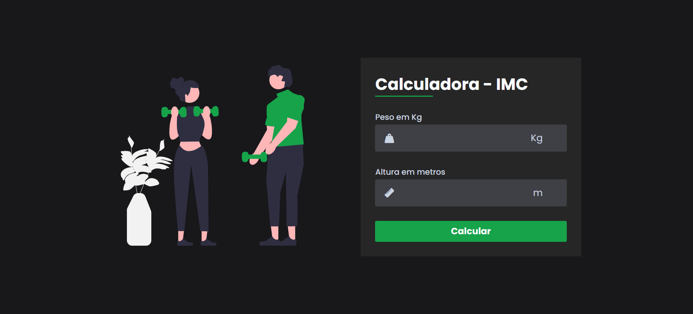

# Calculadora de IMC

Uma aplicação web para cálculo do Índice de Massa Corporal (IMC), desenvolvida com HTML, CSS e JavaScript.

O usuário informa seu peso e sua altura, e a aplicação realiza o cálculo do IMC de forma dinâmica.

<p align="center">
  
</p>

## Tecnologias


## Demonstração

Acesse o projeto publicado:

[**Visualizar a Calculadora de IMC**](https://anacrisbrito.github.io/Calculadora-de-IMC-com-HTML-CSS-e-JavaScript/)

## Funcionalidades

- Entrada de peso em quilogramas (kg).
- Entrada de altura em metros (m).
- Cálculo automático do IMC.
- Interação dinâmica utilizando JavaScript.
- Interface intuitiva e responsiva.
- Layout desenvolvido com HTML e CSS.

## Estrutura do Projeto

```text
Calculadora-de-IMC-com-HTML-CSS-e-JavaScript/
├── assets/
│   ├── css/
│   │   └── style.css
│   ├── images/
│   │   └── illustration.svg
│   │   └── calculadora-imc-preview.png
│   └── js/
├── index.html
└── README.md
```

## Como Executar

1. Clone o repositório
```bash
git clone [https://github.com/AnaCrisBrito/Calculadora-de-IMC-com-HTML-CSS-e-JavaScript.git](https://github.com/AnaCrisBrito/Calculadora-de-IMC-com-HTML-CSS-e-JavaScript.git)
```

2. Acesse a pasta do projeto
```bash
cd Calculadora-de-IMC-com-HTML-CSS-e-JavaScript
```

3. Execute o projeto
Abra o arquivo `index.html` em um navegador.

Não é necessário instalar dependências ou configurar um servidor para executar a aplicação.

## Objetivo

Este projeto foi desenvolvido como prática de desenvolvimento Front-End, com foco na utilização de HTML, CSS e JavaScript para criar uma aplicação interativa e realizar cálculos a partir dos dados informados pelo usuário.

## Autora

Ana Cristina Brito de Miranda  
Estudante de Sistemas para Internet.

Desenvolvido para fins de estudo e prática em desenvolvimento Web.